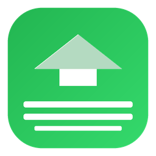

<p align="center">
  <br/>
  
  <br/><br/>
  <strong>DriveDock</strong>
  <br/>
  <em>The cleanest way to upload files to Google Drive from your Mac.</em>
  <br/><br/>
  <a href="LICENSE"></a>
  
  
  
  
  <br/><br/>
</p>

---

DriveDock is a native macOS app for uploading files and folders to Google Drive with speed, clarity, and control. Built with Swift and SwiftUI, it feels right at home on your Mac. No Electron. No sync folders. Just a focused, polished uploader that respects your workflow, your privacy, and your time.

---

## Table of Contents

- [Features](#features)
- [Screenshots](#screenshots)
- [Getting Started](#getting-started)
- [Download](#download)
- [Architecture](#architecture)
- [Usage](#usage)
- [Configuration](#configuration)
- [Contributing](#contributing)
- [Security](#security)
- [Roadmap](#roadmap)
- [FAQ](#faq)
- [License](#license)
- [Acknowledgments](#acknowledgments)

---

## Download

Download the latest public build from [GitHub Releases](https://github.com/sayuru-akash/drivedock/releases/latest).

Recommended install:

1. Download `DriveDock-<version>-macOS.dmg`.
2. Open the DMG.
3. Drag `DriveDock.app` to Applications.
4. Launch DriveDock from Applications.

Other install options:

- `DriveDock-<version>-macOS.zip` -- plain zipped app bundle.
- Source build -- clone the repo, configure Google OAuth credentials, and build in Xcode or with `xcodebuild -scheme DriveDock -configuration Release build`.

Release artifacts are Developer ID signed and Apple notarized when the project signing secrets are configured in GitHub Actions. If those secrets are absent, the workflow still publishes ad-hoc signed DMG/zip artifacts so downloads do not break; macOS may require Control-click > Open on first launch. Users who prefer local trust can build from source with their own signing identity.

---

## Features

DriveDock is packed with features designed for speed, reliability, and a native macOS experience. Everything is built to feel fast, safe, and intuitive.

### Upload

- **Drag-and-Drop Uploads** -- Drop files or folders directly onto the main window, the menu bar popover, or the Dock icon to start uploading instantly.
- **Clipboard Paste** -- Paste files from the clipboard with `Cmd+V` to queue them for upload.
- **Folder Uploads with Structure Preservation** -- Upload entire folder hierarchies and DriveDock recreates the exact structure in Google Drive, including nested subfolders.
- **Parallel Uploads** -- Upload multiple files simultaneously with adaptive concurrency that adjusts based on network conditions, error rate, and HTTP 429 responses.
- **Resumable Uploads** -- Large files use Google Drive's resumable upload protocol with 8 MB chunks. If your connection drops or your Mac sleeps, uploads pick up right where they left off. Sessions survive app restarts.
- **Background Uploads** -- Close the main window and DriveDock continues uploading from the menu bar. Progress never stops just because you moved on.
- **Duplicate Handling** -- Choose how DriveDock handles files with the same name: keep both, rename the new file, skip existing, or replace.
- **Batch Upload Intelligence** -- When uploading hundreds of small files, DriveDock caches destination folder IDs, avoids redundant API calls, and processes the queue efficiently.
- **Bandwidth Limiting** -- Cap upload speed to avoid saturating your connection. Configure in Settings > Network.
- **Upload Plan Summary** -- Review file count, total size, and destination before starting an upload.

### Downloads

- **Parallel Downloads** -- Download files from Google Drive with parallel transfer support and progress tracking.
- **Download Queue** -- Download items are tracked with the same queue persistence and status visibility as uploads.

### Account Management

- **Multi-Account Support** -- Connect multiple Google accounts and switch between personal, work, and Shared Drive accounts without friction.
- **Per-Upload Account Selection** -- Choose which account to use for each upload batch. Queue items stay locked to the account selected at creation.
- **Shared Drive Support** -- Browse and upload to Google Shared Drives you have access to, with full permission awareness.
- **Secure Token Storage** -- OAuth tokens are stored exclusively in macOS Keychain. No plain files, no logs, no exceptions.
- **Graceful Token Recovery** -- Expired tokens refresh silently. If refresh fails, DriveDock pauses affected uploads and clearly asks you to reconnect.

### Queue

- **Full Queue Control** -- Pause, resume, cancel, retry, reorder, and prioritise individual uploads or entire batches.
- **Queue Persistence** -- The queue survives app restarts, Mac sleep, and network interruptions. Pending items remain queued; completed items move to history.
- **Smart Retry with Backoff** -- Failed uploads retry automatically using exponential backoff with jitter. Rate limits reduce concurrency instead of causing repeated failures.
- **Status Visibility** -- Every queue item shows its state at a glance: preparing, waiting, uploading, paused, completed, failed, cancelled, or needs attention.
- **Network Monitoring** -- DriveDock detects connectivity changes and pauses uploads on disconnection. It auto-resumes when the network returns. Sleep and wake are handled gracefully.

### UI

- **Native macOS Design** -- Built entirely with SwiftUI and AppKit where needed. Supports light mode, dark mode, translucent materials, and standard macOS window behaviours.
- **Accent Colour Customisation** -- Choose from 6 accent colours to personalise the app's appearance.
- **Menu Bar Helper** -- A persistent menu bar icon shows upload progress, active count, a quick drop zone, and account switching. Optionally hide the Dock icon and run entirely from the menu bar.
- **Destination Picker** -- Browse My Drive and Shared Drives, search folders, create new folders, and pin recent or favourite destinations.
- **Drive Browser** -- Full Drive browsing with breadcrumb navigation, Shared Drive support, and folder creation directly from the destination picker.
- **Upload History** -- Track every upload with timestamps, file size, duration, average speed, destination, account, status, and Drive links.
- **Completion Summaries** -- After a batch finishes, see a clear report: total files, total size, failed/skipped count, duration, and a button to open the Drive folder.
- **Export Reports** -- Export upload history as CSV, JSON, or plain text. Useful for agencies, teams, and audit trails.
- **Native Notifications** -- Get notified when batches complete, errors need attention, or large uploads finish. Notifications include action buttons. Fully configurable in Settings.

### Security

- **Keychain-Only Credentials** -- All OAuth tokens live in macOS Keychain. DriveDock never writes tokens to disk, logs, or local storage.
- **Biometric Protection** -- Optionally protect Keychain tokens with Touch ID or Apple Watch authentication.
- **Security-Scoped Bookmarks** -- Dragged files are accessed via security-scoped bookmarks for proper sandbox compliance.
- **Minimal OAuth Scopes** -- DriveDock requests only the permissions it genuinely needs. No unnecessary profile or contact scopes.
- **No Analytics or Tracking** -- Zero telemetry. Zero hidden tracking. Your files and activity stay on your Mac.
- **Open Source** -- Every line of code is publicly auditable. DriveDock does exactly what it says.
- **Local-First Architecture** -- Queue state, upload sessions, history, and preferences are stored locally. DriveDock communicates only with Google Drive APIs using your authorised account.

---

## Screenshots

<p align="center">
  <em>Screenshots coming soon.</em>
</p>

| View | Description |
|------|-------------|
| **Main Window** | The primary upload interface with drag-and-drop zone, queue list, and status bar. |
| **Queue View** | Grouped queue showing active, waiting, paused, completed, and failed uploads with progress bars. |
| **Destination Picker** | Browse My Drive, Shared Drives, search folders, and create new folders before uploading. |
| **Settings** | General, Upload, Account, Network, Privacy, and Advanced settings panels. |
| **Menu Bar** | Menu bar popover with upload progress, quick drop zone, account switcher, and controls. |

---

## Getting Started

### Prerequisites

Before building DriveDock, make sure you have:

- **macOS 14 Sonoma** or later
- **Xcode 15.0** or later (download from the [Mac App Store](https://apps.apple.com/app/xcode/id497799835))
- **A Google account** with Google Drive access
- **A Google Cloud project** with OAuth 2.0 credentials (instructions below)

### Step 1: Set Up Google Cloud Console

DriveDock uses the Google Drive API with OAuth 2.0 authentication. You need to create credentials in the Google Cloud Console.

1. Go to [Google Cloud Console](https://console.cloud.google.com/).

2. **Create a new project** (or select an existing one):
   - Click the project dropdown at the top of the page
   - Click "New Project"
   - Name it something like `DriveDock Dev`
   - Click "Create"

3. **Enable the Google Drive API**:
   - In the sidebar, go to **APIs & Services > Library**
   - Search for "Google Drive API"
   - Click on it and press **Enable**

4. **Configure the OAuth consent screen**:
   - Go to **APIs & Services > OAuth consent screen**
   - Select **External** user type (for development/testing)
   - Fill in the app name (`DriveDock`), user support email, and developer contact email
   - Add the scope `https://www.googleapis.com/auth/drive.file` (upload files created by the app)
   - Add your email as a test user while the app is in development

5. **Create OAuth 2.0 credentials**:
   - Go to **APIs & Services > Credentials**
   - Click **Create Credentials > OAuth client ID**
   - Select **Desktop application** as the application type
   - Name it `DriveDock Desktop`
   - Click **Create**
   - Copy the **Client ID** (you will need this)

6. **Configure the Client ID in DriveDock**:
   - In Xcode, set the `GOOGLE_OAUTH_CLIENT_ID` build setting or environment variable to your Client ID
   - Alternatively, add it to your local `xcconfig` file (do not commit this file)

### Step 2: Clone the Repository

```bash
git clone https://github.com/sayuru-akash/drivedock.git
cd drivedock
```

### Step 3: Open and Build

Open the project in Xcode:

```bash
open DriveDock.xcodeproj
```

Select the `DriveDock` scheme, choose your Mac as the destination, and press `Cmd+R` to build and run.

Alternatively, build from the command line:

```bash
xcodebuild -scheme DriveDock -configuration Debug build
```

### Step 4: First Launch

1. DriveDock will show the onboarding welcome screen.
2. Click **Connect Google Drive** to start the OAuth flow.
3. Authorise DriveDock in your browser.
4. You will be redirected back to the app with your account connected.
5. Drop files or folders onto the window to start your first upload.

---

## Architecture

DriveDock is built with a clean, modular architecture that separates concerns across well-defined layers.

### Module Breakdown

| Module | Description |
|--------|-------------|
| **App** | App entry point (`@main`), window management, menu bar app lifecycle, global app state. |
| **Core/Models** | Data models for uploads, accounts, queue items, destinations, and history records. |
| **Core/Services/Auth** | OAuth 2.0 flow, token refresh, Keychain storage, multi-account management. |
| **Core/Services/DriveAPI** | Google Drive API v3 integration: folder listing, creation, file metadata, upload initiation, Shared Drive support, error mapping. |
| **Core/Services/Upload** | Upload engine, queue scheduler, parallel workers, resumable sessions, pause/resume/cancel, retry/backoff, speed tracking. |
| **Core/Services/Download** | Download engine with parallel downloads, progress tracking, and batch management. |
| **Core/Services/Persistence** | JSON file storage in `~/Library/Application Support/DriveDock/` for queue, batches, history, settings, and destinations. Uses `NSLock` for thread safety. |
| **Core/Services/Notifications** | macOS native notifications, menu bar status updates, user alerts. |
| **Core/Services/FileAccess** | Drag-and-drop handling, security-scoped bookmarks, folder scanning, MIME type detection, local file validation. |
| **UI/Onboarding** | First-launch welcome, account connection, default behaviour setup, ready screen. |
| **UI/Main** | Main window layout with sidebar, drop zone, queue area, and status bar. |
| **UI/Queue** | Upload queue list, grouped status views, item progress, batch controls. |
| **UI/Inspector** | Right-side detail panel for selected queue items: metadata, progress, speed, errors, actions. |
| **UI/Destination** | Drive folder picker with browsing, search, breadcrumb navigation, folder creation, and recent/starred destinations. |
| **UI/Settings** | Preferences window with General, Upload, Account, Network, Privacy, and Advanced tabs. |
| **UI/History** | Upload history list with filtering, sorting, and report export. |
| **UI/MenuBar** | Menu bar popover with status, drop zone, quick controls, and account switching. |
| **UI/Components** | Shared UI components: progress bars, status badges, empty states, error views. |
| **Utilities** | Helpers, extensions, formatters, constants, and utility functions. |
| **Resources** | Asset catalog, colour definitions, app icon, localisations. |

### Architecture Diagram

```
+------------------------------------------------------------------+
|                          App Shell                                |
|  Window Management · Menu Bar App · Global App State              |
+------------------------------------------------------------------+
          |                    |                    |
          v                    v                    v
+------------------+  +------------------+  +------------------+
|   UI Layer       |  |   UI Layer       |  |   UI Layer       |
|  Onboarding      |  |  Main Window     |  |  Menu Bar        |
|  Destination     |  |  Queue View      |  |  Settings        |
|  History         |  |  Inspector       |  |  Components      |
+------------------+  +------------------+  +------------------+
          |                    |                    |
          v                    v                    v
+------------------------------------------------------------------+
|                      Service Layer                                |
|                                                                   |
|  +-------------+  +-------------+  +-------------+               |
|  | Auth        |  | DriveAPI    |  | Upload      |               |
|  | OAuth       |  | Folders     |  | Queue       |               |
|  | Keychain    |  | Files       |  | Workers     |               |
|  | Tokens      |  | Metadata    |  | Resumable   |               |
|  +-------------+  +-------------+  | Retry/Backoff|              |
|                                     +-------------+               |
|  +-------------+  +-------------+  +-------------+               |
|  | Download    |  | Persistence |  | Notifications|              |
|  | Parallel    |  | JSON files  |  | macOS alerts |              |
|  | Progress    |  | NSLock      |  | Menu status  |              |
|  +-------------+  +-------------+  +-------------+               |
|  +-------------+  +-------------+                                 |
|  | FileAccess  |  | NetworkMon  |                                |
|  | Drag/Drop   |  | Connectivity|                                |
|  | Bookmarks   |  | Auto-pause  |                                |
|  | MIME detect  |  +-------------+                                |
|  +-------------+                                                  |
+------------------------------------------------------------------+
          |                    |                    |
          v                    v                    v
+------------------------------------------------------------------+
|                      Platform Layer                               |
|  Google Drive API v3 · URLSession · Keychain Services             |
|  FileManager · UserNotifications · JSON Persistence               |
+------------------------------------------------------------------+
```

### Design Patterns

| Pattern | Usage |
|---------|-------|
| **MVVM** | Views are bound to view models using `@Observable` (macOS 14+). View models hold state and business logic; views are declarative and composable. |
| **Singleton Services** | Services are `@Observable` singletons injected via `.environment()` and `@Environment`. State management uses `@Observable` and `@Bindable`, never `@StateObject`. |
| **Actor Isolation** | The upload engine uses `@MainActor` for state mutations and `nonisolated` methods for I/O and network operations to avoid blocking. |
| **Dependency Injection** | Services receive their dependencies through initialisers, enabling testability and mock injection in tests. |
| **Strategy Pattern** | Upload modes (Balanced, Fast, Light) and duplicate handling policies are implemented as interchangeable strategies. |
| **Observer Pattern** | `@Observable` macro and `.onChange(of:)` are used for reactive UI updates and cross-module communication. |
| **Continuation Bridge** | OAuth callback from local HTTP server bridged to async/await via `CheckedContinuation`. |
| **Task Deduplication** | Coalesced token refresh prevents concurrent refresh requests for the same account. |

---

## Usage

### First Upload Flow

1. Open DriveDock.
2. Click **Connect Google Drive** and authorise in your browser.
3. Drop files onto the main window (or click **Choose Files**).
4. The destination picker appears. Select a folder in My Drive or a Shared Drive, or create a new folder.
5. Click **Upload**.
6. Watch progress in the queue view. Speed, ETA, and status update in real time.
7. When complete, see the summary with links to open files in Drive.

### Folder Upload Flow

1. Drop a folder onto DriveDock.
2. DriveDock scans the folder structure and shows the total file count and size.
3. Choose whether to preserve the folder structure (enabled by default).
4. Select a destination folder in Drive.
5. DriveDock creates the folder tree in Drive first, then uploads files in parallel.
6. Failed files are isolated and do not block completed files.
7. A completion report shows what succeeded, what failed, and what was skipped.

### Multi-Account Usage

1. Go to **Settings > Accounts** and click **Add Account**.
2. Complete the OAuth flow for each additional Google account.
3. When uploading, the destination picker lets you choose which account to use.
4. Queue items stay locked to the account selected when they were created.
5. Switch the active account in the sidebar to browse different Drive destinations without affecting in-progress uploads.

### Queue Management Tips

- **Pause an item**: Click the pause button on any queued or active item. The upload stops but stays in the queue.
- **Prioritise an upload**: Drag an item to the top of the queue, or right-click and select **Move to Top**.
- **Retry a failed item**: Click the retry icon on any failed item. DriveDock resets its retry counter and attempts the upload again.
- **Clear completed items**: Click **Clear Completed** in the toolbar to remove finished uploads from the queue view (they remain in History).
- **Pause all**: Use the menu bar popover or the toolbar button to pause every active upload at once.

### Menu Bar Usage

- The menu bar icon shows a progress ring when uploads are active.
- Click the icon to open the popover with current status, a quick drop zone, recent completions, and account switching.
- Drag files directly onto the menu bar icon to queue them for upload.
- Use **Pause All** / **Resume All** for quick control without opening the main window.
- Optionally hide the Dock icon in **Settings > General** and run DriveDock entirely from the menu bar.

### Background Uploads

- Close the main window while uploads are in progress. DriveDock continues uploading from the menu bar.
- The menu bar icon shows ongoing progress.
- When uploads complete, a native macOS notification appears.
- If your Mac sleeps, DriveDock pauses gracefully and resumes on wake.
- If your network drops, DriveDock waits and retries automatically when connectivity returns.

### Keyboard Shortcuts

| Shortcut | Action |
|----------|--------|
| `Cmd+N` | New Upload (open destination picker) |
| `Cmd+O` | Add Files |
| `Cmd+Shift+O` | Add Folder |
| `Cmd+P` | Pause All / Resume All |
| `Cmd+R` | Resume All |
| `Cmd+Shift+K` | Clear Completed |
| `Cmd+Option+I` | Toggle Inspector |
| `Cmd+,` | Open Settings |
| `Cmd+V` | Paste Files from Clipboard |
| `Cmd+1` | Show Uploads |
| `Cmd+2` | Show Queue |
| `Cmd+3` | Show Active |
| `Cmd+4` | Show Completed |
| `Cmd+5` | Show Failed |
| `Cmd+6` | Show History |

---

## Configuration

### Upload Modes

DriveDock offers three upload modes to match your workflow:

| Mode | Concurrency | Best For | Behaviour |
|------|-------------|----------|-----------|
| **Balanced** (default) | 3 active uploads | Most users | Good speed with adaptive concurrency. Battery and network aware. Automatically adjusts based on error rate and network quality. |
| **Fast** | 5--8 active uploads | Maximum throughput | Higher parallelism, larger chunks, more aggressive queue processing. Warns if on battery or poor network. |
| **Light** | 1--2 active uploads | Working while uploading | Lower network pressure. Better for video calls, browsing, weak Wi-Fi, and battery conservation. |

### Settings Reference

#### General

| Setting | Default | Description |
|---------|---------|-------------|
| Launch at login | Off | Start DriveDock automatically when you log in to your Mac. |
| Show menu bar icon | On | Display the DriveDock icon in the menu bar with progress and controls. |
| Show Dock icon | On | Show DriveDock in the Dock. Turn off to run entirely from the menu bar. |
| Theme | System | Choose System, Light, or Dark appearance. |
| Accent colour | Blue | Choose from 6 accent colours to personalise the app. |
| Confirm before quitting | On | Ask for confirmation if uploads are active when quitting. |

#### Uploads

| Setting | Default | Description |
|---------|---------|-------------|
| Default upload mode | Balanced | Controls concurrency, chunk size, and network aggressiveness. |
| Default destination | Ask every time | behaviour when no destination is set: Ask, Last Used, or a specific folder. |
| Parallel upload limit | Auto | Maximum concurrent file uploads. Auto-adjusts based on mode. |
| Duplicate handling | Ask | How to handle same-name files: Keep Both, Rename, Skip, or Replace. |
| Ignore hidden files | On | Skip `.DS_Store`, `__MACOSX`, and other macOS metadata files. |
| Preserve folder structure | On | Recreate folder hierarchy in Drive when uploading folders. |
| Auto-retry failed uploads | On | Retry failed uploads automatically with exponential backoff. |
| Resume uploads on launch | On | Resume interrupted uploads when the app starts. |

#### Accounts

| Setting | Description |
|---------|-------------|
| Connected accounts | List of connected Google accounts with status and default destination. |
| Add account | Connect a new Google account via OAuth. |
| Remove account | Disconnect an account and remove its tokens from Keychain. |
| Default account | The account used by default for new uploads. |

#### Network

| Setting | Default | Description |
|---------|---------|-------------|
| Pause on metered network | Off | Automatically pause uploads on metered or hotspot-like connections. |
| Bandwidth limit | Unlimited | Cap upload speed in KB/s to avoid saturating your connection. |
| Retry behaviour | Auto | Number of retries and backoff strategy for failed uploads. |

#### Privacy

| Setting | Description |
|---------|-------------|
| Clear local history | Remove all upload history records. |
| Clear queue cache | Remove all pending queue items. |
| Remove all local data | Delete all local app data including preferences, history, and queue. |
| Remove tokens | Delete all OAuth tokens from Keychain. |

### Environment Variables

For development builds, you can configure DriveDock using environment variables set in Xcode scheme settings or your shell:

| Variable | Description |
|----------|-------------|
| `GOOGLE_OAUTH_CLIENT_ID` | Your Google OAuth 2.0 client ID. Required for development builds. |
| `DRIVEDOCK_DEBUG_LOGS` | Set to `1` to enable verbose debug logging. |
| `DRIVEDOCK_MAX_CONCURRENCY` | Override the maximum number of concurrent uploads (integer). |

---

## Contributing

We welcome contributions from the community. Whether you are fixing a bug, adding a feature, improving documentation, or reporting an issue, your help is appreciated.

See [CONTRIBUTING.md](CONTRIBUTING.md) for detailed guidelines including:

- Development environment setup
- Code style and conventions
- Pull request process
- Testing guidelines
- Issue reporting

### Quick Start for Contributors

```bash
# 1. Fork and clone
git clone https://github.com/YOUR_USERNAME/drivedock.git
cd drivedock

# 2. Create a feature branch
git checkout -b feature/your-feature-name

# 3. Open in Xcode
open DriveDock.xcodeproj

# 4. Make your changes, build, and test
#    Cmd+B to build, Cmd+U to run tests

# 5. Commit and push
git add .
git commit -m "Add your feature description"
git push origin feature/your-feature-name

# 6. Open a pull request on GitHub
```

---

## Security

DriveDock takes security seriously. Credentials are stored in macOS Keychain, the app has zero analytics or tracking, and all code is open source and auditable.

See [SECURITY.md](SECURITY.md) for the full security policy, including:

- How to report vulnerabilities
- Security design decisions
- Token storage details
- Supported versions

### Privacy Guarantees

- DriveDock uploads only to the Google account you select.
- DriveDock does not sell, share, or transmit your data to any third party.
- DriveDock does not include analytics, telemetry, or tracking code.
- DriveDock stores OAuth credentials exclusively in macOS Keychain.
- DriveDock is open source. You can inspect every line of code.

---

## Roadmap

### V1.1

- Finder right-click extension polish
- More upload presets (quick-save configurations)
- Better duplicate comparison (size, hash, modified date)
- Improved report export with custom fields
- Expanded Shared Drive features
- Auto-update support via Sparkle

### V1.2

- Scheduled uploads (queue files for a specific time)
- Watch folders (automatically upload files dropped into a local folder)
- Upload rules (route files from specific local folders to specific Drive folders)
- Bandwidth schedules (limit upload speed during certain hours)
- Apple Shortcuts support for automation workflows

### V2

- Other cloud providers as optional plugins (Dropbox, OneDrive, S3)
- Team presets for shared upload configurations
- End-to-end upload audit reports
- CLI companion for scripting and automation
- Advanced automation rules and triggers

---

## FAQ

### General

**Q: What makes DriveDock different from Google Drive for Desktop?**

A: Google Drive for Desktop creates a virtual filesystem and syncs folders bidirectionally. DriveDock is a focused uploader. You choose what to upload, where to upload it, and when. No sync folders, no background indexing, no surprises. It is faster, lighter, and gives you full control over every upload.

**Q: Does DriveDock sync files?**

A: No. DriveDock is an uploader, not a sync client. It uploads files and folders to Google Drive on demand. It does not create local sync folders or perform two-way synchronisation.

**Q: Can I upload to Shared Drives?**

A: Yes. DriveDock supports Google Shared Drives. Browse your Shared Drives in the destination picker and upload to any folder you have write access to.

### Uploads

**Q: What happens if my internet drops during an upload?**

A: DriveDock detects the disconnection, pauses affected uploads, and shows "Waiting for connection." When your internet returns, resumable uploads pick up where they left off. You do not need to restart anything.

**Q: What happens if my Mac sleeps during an upload?**

A: DriveDock pauses uploads gracefully before sleep and resumes them on wake. Completed files are not re-uploaded. The status bar explains what happened: "Paused while Mac was asleep" or "Resuming after wake."

**Q: How does DriveDock handle large files?**

A: Large files use Google Drive's resumable upload protocol. DriveDock streams from disk (never loads the full file into memory), tracks progress accurately, and can resume interrupted uploads even after quitting and reopening the app.

**Q: Can I pause an upload and resume it later?**

A: Yes. Click the pause button on any queue item. The upload stops and stays in the queue. Click resume when you are ready. Resumable upload sessions are preserved across app restarts.

**Q: How does duplicate file handling work?**

A: Before uploading, you can choose: keep both files, rename the new file (e.g., `report 2.pdf`), skip if a file with the same name exists, or replace the existing file. The default is to ask when a duplicate is detected.

### Accounts

**Q: Can I use multiple Google accounts?**

A: Yes. Connect as many Google accounts as you need in Settings > Accounts. When uploading, choose which account to use. Each queue item is locked to the account selected at creation time.

**Q: Where are my Google credentials stored?**

A: OAuth tokens are stored exclusively in macOS Keychain. DriveDock never writes tokens to plain files, local databases, or logs. When you disconnect an account, the tokens are deleted from Keychain.

### Technical

**Q: What macOS version do I need?**

A: macOS 14 Sonoma or later. DriveDock uses modern Swift and SwiftUI features that require macOS 14 as the minimum deployment target.

**Q: Does DriveDock work offline?**

A: DriveDock requires an internet connection to upload files to Google Drive. However, you can queue files while offline, and they will upload when connectivity returns.

**Q: Is DriveDock free?**

A: Yes. DriveDock is open source and released under the MIT License. It is free to use, modify, and distribute.

---

## License

DriveDock is released under the [MIT License](LICENSE).

```
MIT License

Copyright (c) 2026 DriveDock Contributors

Permission is hereby granted, free of charge, to any person obtaining a copy
of this software and associated documentation files (the "Software"), to deal
in the Software without restriction, including without limitation the rights
to use, copy, modify, merge, publish, distribute, sublicense, and/or sell
copies of the Software, and to permit persons to whom the Software is
furnished to do so, subject to the following conditions:

The above copyright notice and this permission notice shall be included in all
copies or substantial portions of the Software.

THE SOFTWARE IS PROVIDED "AS IS", WITHOUT WARRANTY OF ANY KIND, EXPRESS OR
IMPLIED, INCLUDING BUT NOT LIMITED TO THE WARRANTIES OF MERCHANTABILITY,
FITNESS FOR A PARTICULAR PURPOSE AND NONINFRINGEMENT. IN NO EVENT SHALL THE
AUTHORS OR COPYRIGHT HOLDERS BE LIABLE FOR ANY CLAIM, DAMAGES OR OTHER
LIABILITY, WHETHER IN AN ACTION OF CONTRACT, TORT OR OTHERWISE, ARISING FROM,
OUT OF OR IN CONNECTION WITH THE SOFTWARE OR THE USE OR OTHER DEALINGS IN THE
SOFTWARE.
```

---

## Acknowledgments

- **Google Drive API** -- DriveDock is built on top of the Google Drive API v3. Thanks to the Google Workspace team for comprehensive documentation and a robust API.
- **Swift and SwiftUI** -- The Swift language and SwiftUI framework make native macOS development a joy. Thanks to the Swift open-source community and the Apple engineering teams.
- **macOS Community** -- Thanks to the macOS developer community for sharing knowledge on Keychain integration, AppKit bridging, background behaviour, sandboxing, and notarisation.
- **Contributors** -- Every contributor who reports a bug, suggests a feature, submits a pull request, or improves documentation helps make DriveDock better. Thank you.
- **Open Source** -- DriveDock stands on the shoulders of open-source tools and libraries. We are grateful for the ecosystem that makes projects like this possible.

---

<p align="center">
  <br/>
  <strong>DriveDock</strong>
  <br/>
  <em>Built with Swift. Designed for Mac. Made for Google Drive.</em>
  <br/><br/>
  <a href="https://github.com/sayuru-akash/drivedock">GitHub</a> · <a href="https://github.com/sayuru-akash/drivedock/issues">Issues</a> · <a href="https://github.com/sayuru-akash/drivedock/releases">Releases</a>
  <br/><br/>
</p>
